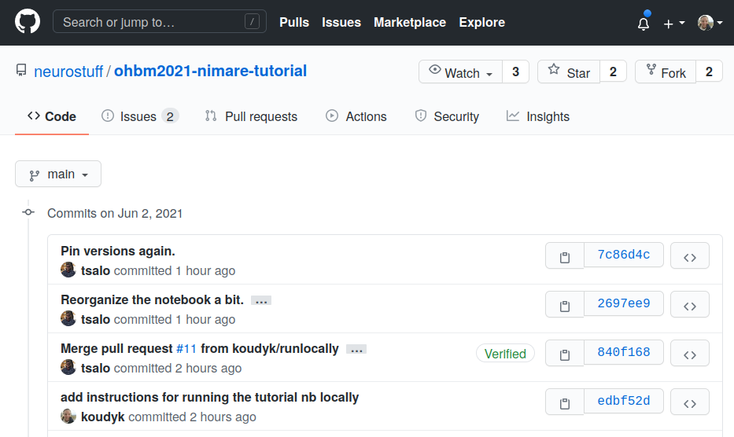
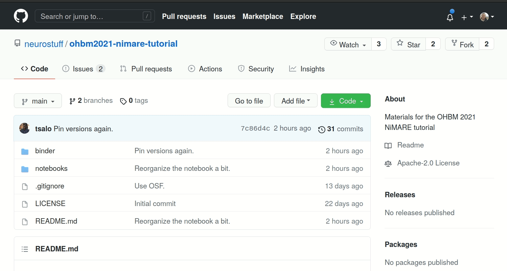
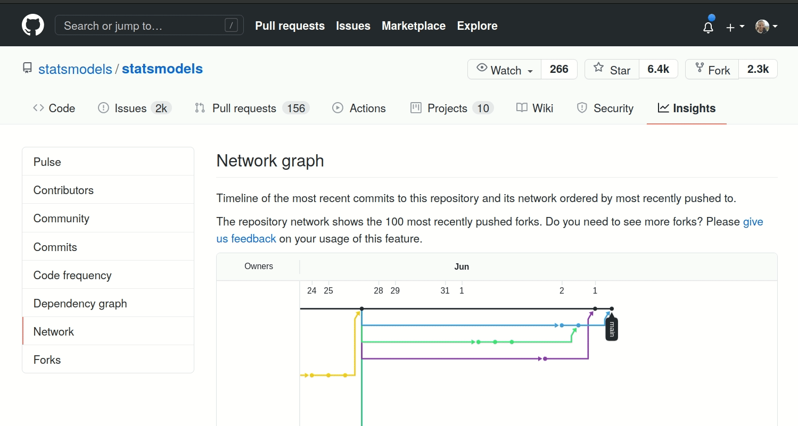
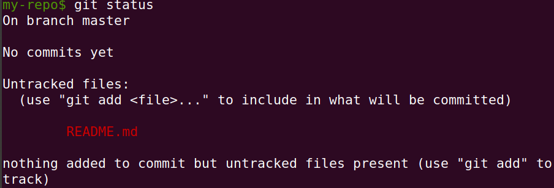
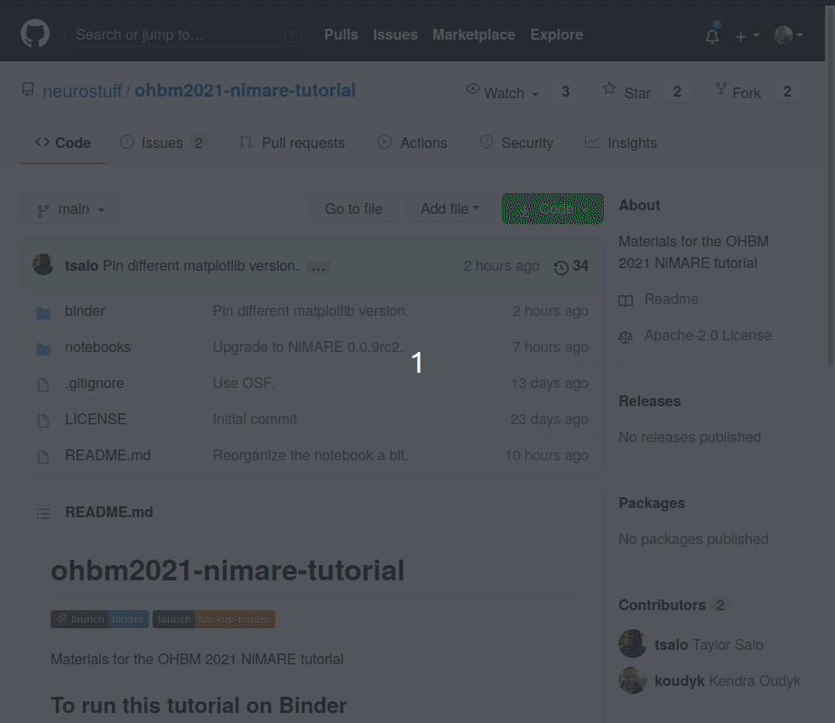
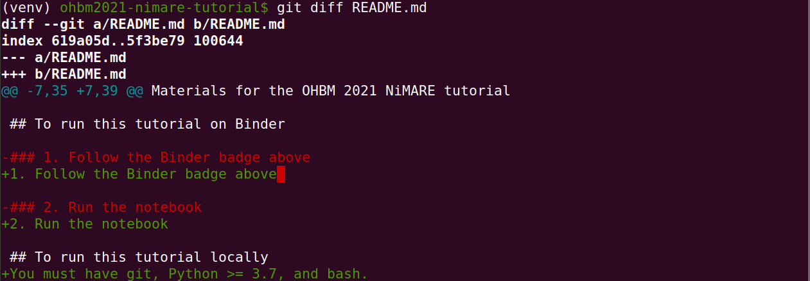
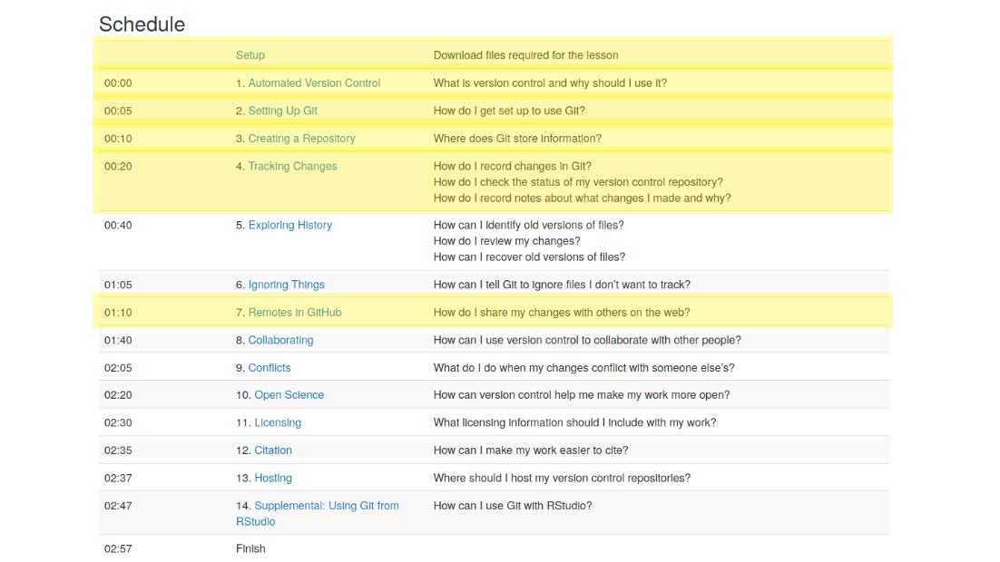

---
jupyter:
  jupytext:
    encoding: '# -*- coding: utf-8 -*-'
    formats: ipynb,md
    text_representation:
      extension: .md
      format_name: markdown
      format_version: '1.3'
      jupytext_version: 1.11.2
  kernelspec:
    display_name: Python 3
    language: python
    name: python3
---

<!-- #region slideshow={"slide_type": "skip"} -->

<!-- #endregion -->

<!-- #region slideshow={"slide_type": "slide"} -->
Kendra, click record!
<!-- #endregion -->

<!-- #region slideshow={"slide_type": "subslide"} -->
# Introduction to Git and GitHub

Kendra Oudyk

2021-06-06

Much of this is borrowed from the [**"Version control with Git"**](https://swcarpentry.github.io/git-novice/) tutorial by Software Carpentries
<!-- #endregion -->

<!-- #region slideshow={"slide_type": "slide"} -->
# Goals
1. **Explain why git/GitHub are useful**
2. Explain basically how git works
3. Track and share your work using git/GitHub
4. Contribute to a project using git/GitHub
<!-- #endregion -->

<!-- #region slideshow={"slide_type": "slide"} -->

“Piled Higher and Deeper” by Jorge Cham, http://www.phdcomics.com

*Note: we don't usually track doc's with git*
<!-- #endregion -->

<!-- #region slideshow={"slide_type": "slide"} -->
# Automated version control
<!-- #endregion -->

<!-- #region slideshow={"slide_type": "subslide"} -->
### Record versions by tracking *changes*
It's like having an unlimited "undo" button

<!-- #endregion -->

<!-- #region slideshow={"slide_type": "subslide"} -->
### Make independent changes

<!-- #endregion -->

<!-- #region slideshow={"slide_type": "fragment"} -->
### And incorporate the changes

https://swcarpentry.github.io/git-novice/
<!-- #endregion -->

<!-- #region slideshow={"slide_type": "subslide"} -->
# Git vs GitHub

Git is the language.

GitHub hosts git repositories in remote locations. 
<!-- #endregion -->

<!-- #region slideshow={"slide_type": "subslide"} -->
# Git & GitHub make your work more efficient

"Time is money"
<!-- #endregion -->

<!-- #region slideshow={"slide_type": "subslide"} -->
# Git & GitHub let you track your work
<!-- #endregion -->

<!-- #region slideshow={"slide_type": "fragment"} -->
# ... as well as info *about* your work

- what was the change
- who did it
- why
- when
<!-- #endregion -->

<!-- #region slideshow={"slide_type": "subslide"} -->

<!-- #endregion -->

<!-- #region slideshow={"slide_type": "fragment"} -->

<!-- #endregion -->

<!-- #region slideshow={"slide_type": "subslide"} -->

<!-- #endregion -->

<!-- #region slideshow={"slide_type": "slide"} -->
# Git/GitHub can help you do Open Science
<!-- #endregion -->

<!-- #region slideshow={"slide_type": "fragment"} -->

(Credit to Christina Bergmann for the idea of the 'Open Science Buffet')
<!-- #endregion -->

<!-- #region slideshow={"slide_type": "slide"} -->
# Goals
1. Explain why git/GitHub are useful
2. **Explain basically how git works**
3. Track and share your work using git/GitHub
4. Contribute to a project using git/GitHub
<!-- #endregion -->

<!-- #region slideshow={"slide_type": "subslide"} -->
# What's a repository?

- all files & folders in the project
- each file's revision history
<!-- #endregion -->

<!-- #region slideshow={"slide_type": "fragment"} -->

<!-- #endregion -->

<!-- #region slideshow={"slide_type": "slide"} -->
# What are branches?
<!-- #endregion -->

<!-- #region slideshow={"slide_type": "fragment"} -->

<!-- #endregion -->

<!-- #region slideshow={"slide_type": "subslide"} -->

<!-- #endregion -->

<!-- #region slideshow={"slide_type": "fragment"} -->
git was originally made for Linux development, which involves 1000's of contributers.
<!-- #endregion -->

<!-- #region slideshow={"slide_type": "subslide"} -->
# What does all this *actually* look like?

What is git actually tracking?

MORE HERE JB

- commits
- branches
<!-- #endregion -->

<!-- #region slideshow={"slide_type": "slide"} -->
# Goals
1. Explain why git/GitHub are useful
2. Explain basically how git works
3. **Track and share your work using git/GitHub**
4. Contribute to a project using git/GitHub
<!-- #endregion -->

<!-- #region slideshow={"slide_type": "subslide"} -->
### Common workflow
# Track and share your work using git/GitHub
<!-- #endregion -->

<!-- #region slideshow={"slide_type": "subslide"} -->

<!-- #endregion -->

<!-- #region slideshow={"slide_type": "subslide"} -->
## Create a new directory
And change into the directory

`mkdir <directory name>`\
`cd <directory name>`

<!-- #endregion -->

<!-- #region slideshow={"slide_type": "fragment"} -->
## Make it into a git repository
`git init`

<!-- #endregion -->

<!-- #region slideshow={"slide_type": "subslide"} -->
## Make a change
e.g., create a file called 'README.md'

<!-- #endregion -->

<!-- #region slideshow={"slide_type": "fragment"} -->
## Check what git is aware of
`git status`

<!-- #endregion -->

<!-- #region slideshow={"slide_type": "subslide"} -->
## Add the file so git is aware of it
Put it in the "staging area"

<!-- #endregion -->

<!-- #region slideshow={"slide_type": "fragment"} -->
`git add <filename>`

<!-- #endregion -->

<!-- #region slideshow={"slide_type": "subslide"} -->
## Take a snapshot of the staging area

<!-- #endregion -->

<!-- #region slideshow={"slide_type": "fragment"} -->
`git commit -m "<short, informative commit message>"`

<!-- #endregion -->

<!-- #region slideshow={"slide_type": "subslide"} -->
## Create a corresponding GitHub repo for sharing your work

<!-- #endregion -->

<!-- #region slideshow={"slide_type": "subslide"} -->
## Tell git the address of your remote repository
`git remote add <remote name> <remote location>`

<!-- #endregion -->

<!-- #region slideshow={"slide_type": "fragment"} -->
## Rename principal branch from *master* to *main* (if needed)

<!-- #endregion -->

<!-- #region slideshow={"slide_type": "subslide"} -->
## Push changes to github
`git push <remote> <branch>`\
(the `-u` is needed only the first time) 

*Note that GitHub is depreciating this authentication method*
<!-- #endregion -->

<!-- #region slideshow={"slide_type": "slide"} -->
# Goals
1. Explain why git/GitHub are useful
2. Explain basically how git works
3. Track and share your work using git/GitHub
4. **Contribute to a project using git/GitHub**
<!-- #endregion -->

<!-- #region slideshow={"slide_type": "subslide"} -->
### Common workflow
# Contributing to a project using git/GitHub
<!-- #endregion -->

<!-- #region slideshow={"slide_type": "subslide"} -->

<!-- #endregion -->

<!-- #region slideshow={"slide_type": "subslide"} -->
## Open/find an issue to work on

<!-- #endregion -->

<!-- #region slideshow={"slide_type": "subslide"} -->
## (Wait for approval)
<!-- #endregion -->

<!-- #region slideshow={"slide_type": "subslide"} -->
## Fork the respository on GitHub
(If you haven't already)

<!-- #endregion -->

<!-- #region slideshow={"slide_type": "subslide"} -->
## Download the forked repository onto your machine
`git clone <remote's url>.git`

<!-- #endregion -->

<!-- #region slideshow={"slide_type": "fragment"} -->
## Or, if you already have it, pull any changes that your collaborators made
`git pull <remote> <branch>`

<!-- #endregion -->

<!-- #region slideshow={"slide_type": "subslide"} -->
## Prepare to make changes
Create a new branch on which store any new changes, and switch to that branch

`git checkout -b <yourBranch>` \
(`git branch <yourBranch>` + `git checkout <yourBranch>`)

<!-- #endregion -->

<!-- #region slideshow={"slide_type": "subslide"} -->
## Make changes
<!-- #endregion -->

<!-- #region slideshow={"slide_type": "subslide"} -->
## See changes
`git status`

<!-- #endregion -->

<!-- #region slideshow={"slide_type": "fragment"} -->
`git diff`

<!-- #endregion -->

<!-- #region slideshow={"slide_type": "subslide"} -->
## Stage changes
`git add <file1> <file2>`

<!-- #endregion -->

<!-- #region slideshow={"slide_type": "subslide"} -->
## Take the snapshot of the staging area
`git commit -m "<short, informative commit message>"`

<!-- #endregion -->

<!-- #region slideshow={"slide_type": "subslide"} -->
## Share your work
`git push <remote> <branch>`

<!-- #endregion -->

<!-- #region slideshow={"slide_type": "subslide"} -->
## Pull request
(ask collaborators to add your changes)

<!-- #endregion -->

<!-- #region slideshow={"slide_type": "subslide"} -->
## Let's see how the graph changed

<!-- #endregion -->

<!-- #region slideshow={"slide_type": "slide"} -->
# Goals
1. Explain why git/GitHub are useful
2. Explain basically how git works
3. Track and share your work using git/GitHub
4. Contribute to a project using git/GitHub

*We'll practice 3. and 4. at the end of this workshop*
<!-- #endregion -->

<!-- #region slideshow={"slide_type": "subslide"} -->
### Check your understanding

# Why would you use git? 
Explain it in one sentence to a new grad student.

<!-- #endregion -->

<!-- #region slideshow={"slide_type": "subslide"} -->
### Check your understanding

# What does git track?
a) letter changes\
b) line changes\
c) document changes

<!-- #endregion -->

<!-- #region slideshow={"slide_type": "fragment"} -->

<!-- #endregion -->

<!-- #region slideshow={"slide_type": "subslide"} -->
### Check your understanding
# Put these commands in order
to form a basic workflow for tracking and sharing a change. 

`commit` &nbsp; &nbsp;
`push` &nbsp; &nbsp;
`add` &nbsp; &nbsp;

- make a change
- stage the change: `git ____ <filename>`
- commit the change: `git ____ -m "<commit message>"`
- put the change on GitHub: `git ____ origin main`

<!-- #endregion -->

<!-- #region slideshow={"slide_type": "slide"} -->
# There's so much more!
<!-- #endregion -->

<!-- #region slideshow={"slide_type": "fragment"} -->
# Git buffet

<!-- #endregion -->

<!-- #region slideshow={"slide_type": "slide"} -->
# Git is hard
Here are some tips
<!-- #endregion -->

<!-- #region slideshow={"slide_type": "subslide"} -->
## Sit down and go through a tutorial

<!-- #endregion -->

<!-- #region slideshow={"slide_type": "subslide"} -->
## Don't expect to remember everything

<!-- #endregion -->

<!-- #region slideshow={"slide_type": "subslide"} -->
## Keep common commands on a sticky note

<!-- #endregion -->
<!-- #region slideshow={"slide_type": "slide"} -->
# The End

Software Carpentry's tutorial: https://swcarpentry.github.io/git-novice/

<!-- #endregion -->
